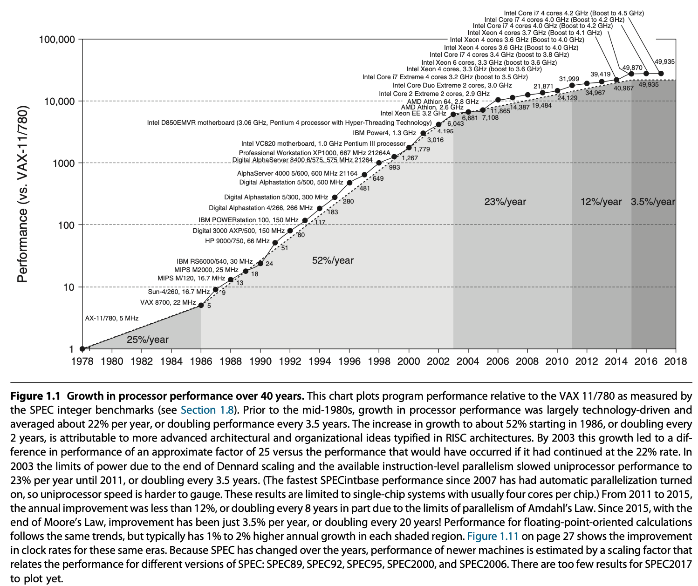

# Computer Architecture 
These are notes taken while reading, Hennessy, Patterson: Computer Architecture: A Quantitative Approach, 6th Edition. Information form other sources has been added as well.

## Foreword
Much of the improvement in computer performance over the last 40 years has been provided by computer architecture advancements that have leveraged **Moore’s Law**(1965 claim by Gordon Moore) and **Dennard scaling**(1974 paper) to build larger and more parallel systems. Moore’s Law is the observation that the maximum number of transistors in an integrated circuit doubles approximately every two years. Dennard scaling states, roughly, that as transistors get smaller, their power density stays constant, so that the power use stays in proportion with area; both voltage and current scale (downward) with length.

Combined with Moore's law, dennard scaling means in every technology generation, if the transistor density doubles, the circuit becomes faster, and power 
consumption (with twice the number of transistors) stays the same. This means that performance per watt grows even faster, doubling about every 18 months. 
This trend is sometimes referred to as Koomey's law.

We hit the limit of denard scaling a decade ago(the law broke down around 2004-2006), and there has been a recent slowdown of Moore’s Law due to a combination of 
physical limitations and economic factors. As of 2016, transistor counts in integrated circuits are still growing, but the resulting improvements in performance 
are more gradual than the speed-ups resulting from significant frequency increases. The primary reason cited for the breakdown is that at small sizes, current l
eakage poses greater challenges and also causes the chip to heat up, which creates a threat of thermal runaway and therefore further increases energy costs.

The breakdown of Dennard scaling and resulting inability to increase clock frequencies significantly has caused most CPU manufacturers to focus on multicore 
processors as an alternative way to improve performance. This lead to a change in focus from instruction level parallelism(ILP) to data-level parallelism(DLP) and 
thread level parallelism(TLP).  Whereas the compiler and hardware conspire to exploit ILP implicitly without the programmer’s attention, DLP and TLP are explicitly parallel, requiring the restructuring of the application so that it can exploit explicit parallelism. An increased core count benefits many (though by no means all) workloads, but the increase in active switching elements from having multiple cores still results in increased overall power consumption and thus worsens CPU power dissipation issues. The end result is that only some fraction of an integrated circuit can actually be active at any given point in time without violating power constraints. The remaining (inactive) area is referred to as dark silicon.  This is why one rarely sees clock frequencies for CPUs much above 3.5 GHz these days, with 5.0 GHz pretty much the upper limit now. 

#### Custom Architectures 
It’s long been known that customized domain-specific archi- tectures can have higher performance, lower power, and require less silicon area than general-purpose
processor implementations. However when general-purpose processors were increasing in single-threaded performance by 40% per year, the extra time to market 
required to develop a custom architecture vs. using a leading-edge standard microprocessor could cause the custom architecture to lose much of its advantage. 
In contrast, today single-core performance is improving very slowly, meaning that the benefits of custom architectures will not be made obsolete by general-purpose
processors for a very long time, if ever. Examples of custom architectures: Deep neural networks have very high computation requirements but lower data precision
requirements – this combination can benefit significantly from custom architectures. 

## Chapter - 1

During the first 25 years of electronic computers there was a performance improvement of about 25% per year. The late 1970s saw the emergence of the microprocessor. The ability of the microprocessor to ride the improvements in integrated circuit technology led to a higher rate of performance improvement—roughly 35% growth per year.

Two significant changes made it easier to succeed commercially. First, the virtual elimination of assembly language programming reduced the need for object-code compatibility. Second, the creation of standardized, vendor-independent operating systems, such as UNIX and its clone, Linux, lowered the cost and risk of bringing out a new architecture.

These changes made it possible to develop successfully a new set of architectures with simpler instructions, called RISC (Reduced Instruction Set Computer) architectures, in the early 1980s. THese machines focused on 2 critical performance techniques, the exploitation of instruction-level parallelism (initially through pipelining and later through multiple instruction issue) and the use of caches (initially in simple forms and later using more sophisticated organizations and optimizations). The RISC-based computers raised the performance bar, forcing prior architec- tures to keep up or disappear. Intel rose to the challenge, primarily by translating 80x86 instructions into RISC-like instructions internally, allowing it to adopt many of the innovations first pioneered in the RISC designs. As transistor counts soared in the late 1990s, the hardware overhead of translating the more complex x86 architecture became negligible. 

**Amdahl’s Law** : It prescribes practical limits to the number of useful cores per chip. If 10% of the task is serial, then the maximum performance benefit from parallelism is 10 no matter how many cores you put on the chip.

Improvement of semiconductor manufacturing as predicted by Moore’s law has led to the dominance of microprocessor-based computers across the entire range of computer design. Minicomputers, which were traditionally made from off-the-shelf logic or from gate arrays, were replaced by servers made by using microprocessors. Even mainframe computers and high-performance supercomputers are all collections of microprocessors.

This 50,000-fold performance improvement since 1978 allowed modern programmers to trade performance for productivity. In place of performance-oriented languages like C and C++, much more program- ming today is done in managed programming languages like Java and Scala. Software deployment is changing as well, with Software as a Service (SaaS) used over the Internet replacing shrink-wrapped software that must be installed and run on a local computer. 

Currently the only path left to improve energy-performance-cost is specialization. Future microprocessors will include several domain-specific cores that perform only one class of computations well, but they do so remarkably better than general-purpose cores. 

### Classes of Parallelism and Parallel Architectures
There are basically two kinds of parallelism in applications:
1. Data-level parallelism (DLP) arises because there are many data items that can be operated on at the same time.
2. Task-level parallelism (TLP) arises because tasks of work are created that can operate independently and largely in parallel.

Computer hardware in turn can exploit these two kinds of application parallelism in four major ways:
- Instruction-level parallelism exploits data-level parallelism at modest levels with compiler help using ideas like pipelining and at medium levels using ideas like speculative execution.
- Vector architectures, graphic processor units (GPUs), and multimedia instruc- tion sets exploit data-level parallelism by applying a single instruction to a col- lection of data in parallel.
- Thread-levelparallelismexploitseitherdata-levelparallelismortask-levelpar- allelism in a tightly coupled hardware model that allows for interaction between parallel threads.
- Request-level parallelism exploits parallelism among largely decoupled tasks specified by the programmer or the operating system.

When Flynn (1966) studied the parallel computing efforts in the 1960s, he found a simple classification whose abbreviations we still use today.
1. Single instruction stream, single data stream (SISD) — This category is the uniprocessor i.e. standard sequential computer, but it can exploit ILP techniques such as superscalar and speculative execution.
2. Single instruction stream, multiple data streams (SIMD) — The same instruction is executed by multiple processors using different data streams. SIMD computers exploit data-level parallelism by applying the same operations to multiple items of data in parallel. Each processor has its own data memory, but there is a single instruction memory and control processor, which fetches and dispatches instructions. It is used in vector architectures, multimedia extensions to standard instruction sets, and GPUs.
3. Multipleinstructionstreams,singledatastream(MISD) — No commercial multiprocessor of this type has been built to date, but it rounds out this simple classification.
4. Multiple instruction streams, multiple data streams (MIMD) — Each processor fetches its own instructions and operates on its own data, and it targets task-level parallelism. In general, MIMD is more flexible than SIMD and thus more generally applicable, but it is inherently more expensive than SIMD. This overhead means that grain size must be sufficiently large to exploit the parallelism efficiently.

This taxonomy is a coarse model, as many parallel processors are hybrids of the SISD, SIMD, and MIMD classes. 

### Defining Computer Architecture

