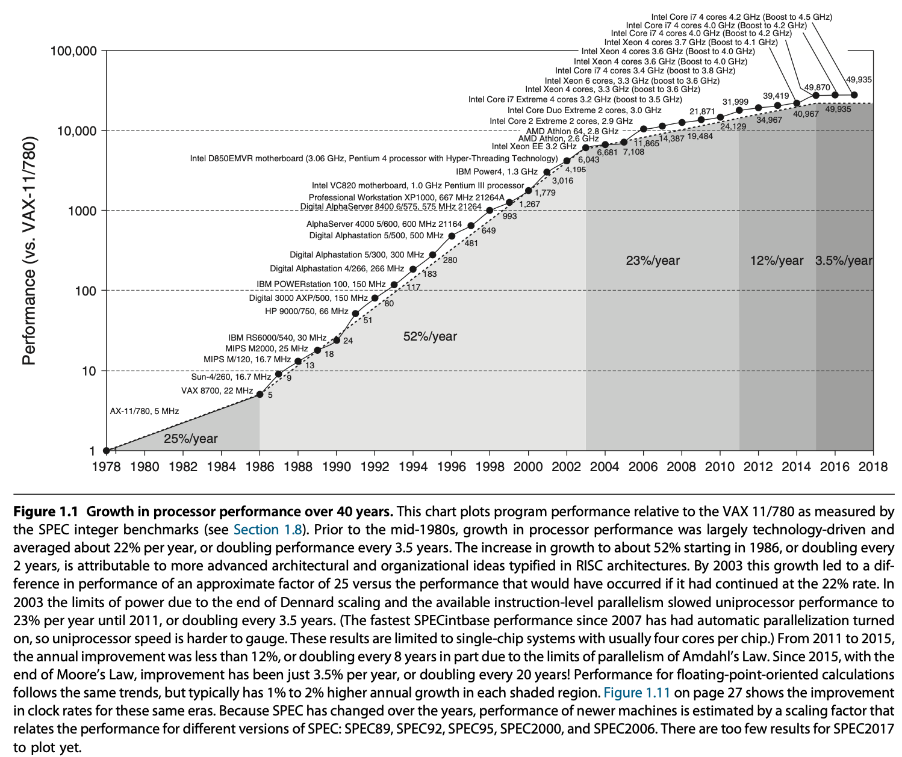
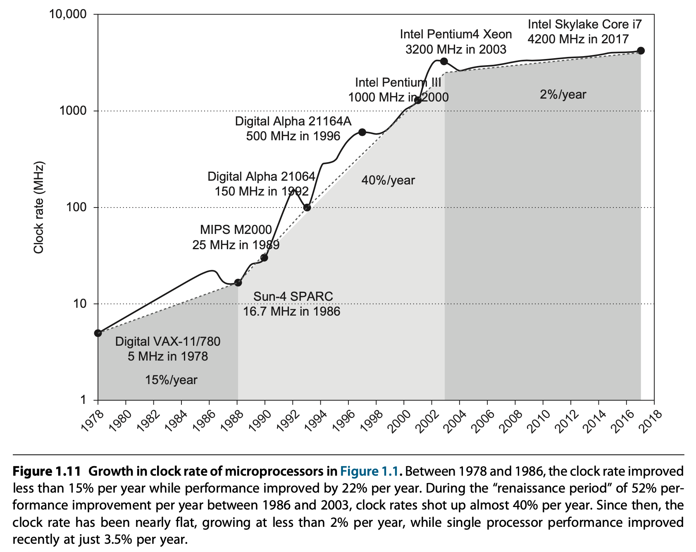

# Computer Architecture 
These are notes taken while reading, Hennessy, Patterson: Computer Architecture: A Quantitative Approach, 6th Edition. Information form other sources has been added as well.

## Foreword
Much of the improvement in computer performance over the last 40 years has been provided by computer architecture advancements that have leveraged **Moore’s Law**(1965 claim by Gordon Moore) and **Dennard scaling**(1974 paper) to build larger and more parallel systems. Moore’s Law is the observation that the maximum number of transistors in an integrated circuit doubles approximately every two years. Dennard scaling states, roughly, that as transistors get smaller, their power density stays constant, so that the power use stays in proportion with area; both voltage and current scale (downward) with length.

[Video : Moore's law in details](https://www.youtube.com/watch?v=I4yPek19cn8).

Combined with Moore's law, dennard scaling means in every technology generation, if the transistor density doubles, the circuit becomes faster, and power 
consumption (with twice the number of transistors) stays the same. This means that performance per watt grows even faster, doubling about every 18 months. 
This trend is sometimes referred to as Koomey's law.

We hit the limit of denard scaling a decade ago(the law broke down around 2004-2006), and there has been a recent slowdown of Moore’s Law due to a combination of 
physical limitations and economic factors. As of 2016, transistor counts in integrated circuits are still growing, but the resulting improvements in performance 
are more gradual than the speed-ups resulting from significant frequency increases. The primary reason cited for the breakdown is that at small sizes, current l
eakage poses greater challenges and also causes the chip to heat up, which creates a threat of thermal runaway and therefore further increases energy costs.

The breakdown of Dennard scaling and resulting inability to increase clock frequencies significantly has caused most CPU manufacturers to focus on multicore 
processors as an alternative way to improve performance. This lead to a change in focus from instruction level parallelism(ILP) to data-level parallelism(DLP) and 
thread level parallelism(TLP).  Whereas the compiler and hardware conspire to exploit ILP implicitly without the programmer’s attention, DLP and TLP are explicitly parallel, requiring the restructuring of the application so that it can exploit explicit parallelism. An increased core count benefits many (though by no means all) workloads, but the increase in active switching elements from having multiple cores still results in increased overall power consumption and thus worsens CPU power dissipation issues. The end result is that only some fraction of an integrated circuit can actually be active at any given point in time without violating power constraints. The remaining (inactive) area is referred to as dark silicon.  This is why one rarely sees clock frequencies for CPUs much above 3.5 GHz these days, with 5.0 GHz pretty much the upper limit now. 

#### Custom Architectures 
It’s long been known that customized domain-specific archi- tectures can have higher performance, lower power, and require less silicon area than general-purpose
processor implementations. However when general-purpose processors were increasing in single-threaded performance by 40% per year, the extra time to market 
required to develop a custom architecture vs. using a leading-edge standard microprocessor could cause the custom architecture to lose much of its advantage. 
In contrast, today single-core performance is improving very slowly, meaning that the benefits of custom architectures will not be made obsolete by general-purpose
processors for a very long time, if ever. Examples of custom architectures: Deep neural networks have very high computation requirements but lower data precision
requirements – this combination can benefit significantly from custom architectures. 

## Chapter - 1

During the first 25 years of electronic computers there was a performance improvement of about 25% per year. The late 1970s saw the emergence of the microprocessor. The ability of the microprocessor to ride the improvements in integrated circuit technology led to a higher rate of performance improvement—roughly 35% growth per year.

Two significant changes made it easier to succeed commercially. First, the virtual elimination of assembly language programming reduced the need for object-code compatibility. Second, the creation of standardized, vendor-independent operating systems, such as UNIX and its clone, Linux, lowered the cost and risk of bringing out a new architecture.

These changes made it possible to develop successfully a new set of architectures with simpler instructions, called RISC (Reduced Instruction Set Computer) architectures, in the early 1980s. THese machines focused on 2 critical performance techniques, the exploitation of instruction-level parallelism (initially through pipelining and later through multiple instruction issue) and the use of caches (initially in simple forms and later using more sophisticated organizations and optimizations). The RISC-based computers raised the performance bar, forcing prior architec- tures to keep up or disappear. Intel rose to the challenge, primarily by translating 80x86 instructions into RISC-like instructions internally, allowing it to adopt many of the innovations first pioneered in the RISC designs. As transistor counts soared in the late 1990s, the hardware overhead of translating the more complex x86 architecture became negligible. 

**Amdahl’s Law** : It prescribes practical limits to the number of useful cores per chip. If 10% of the task is serial, then the maximum performance benefit from parallelism is 10 no matter how many cores you put on the chip.

Improvement of semiconductor manufacturing as predicted by Moore’s law has led to the dominance of microprocessor-based computers across the entire range of computer design. Minicomputers, which were traditionally made from off-the-shelf logic or from gate arrays, were replaced by servers made by using microprocessors. Even mainframe computers and high-performance supercomputers are all collections of microprocessors.

This 50,000-fold performance improvement since 1978 allowed modern programmers to trade performance for productivity. In place of performance-oriented languages like C and C++, much more program- ming today is done in managed programming languages like Java and Scala. Software deployment is changing as well, with Software as a Service (SaaS) used over the Internet replacing shrink-wrapped software that must be installed and run on a local computer. 

Currently the only path left to improve energy-performance-cost is specialization. Future microprocessors will include several domain-specific cores that perform only one class of computations well, but they do so remarkably better than general-purpose cores. 

### Classes of Parallelism and Parallel Architectures
There are basically two kinds of parallelism in applications:
1. Data-level parallelism (DLP) arises because there are many data items that can be operated on at the same time.
2. Task-level parallelism (TLP) arises because tasks of work are created that can operate independently and largely in parallel.

Computer hardware in turn can exploit these two kinds of application parallelism in four major ways:
- Instruction-level parallelism exploits data-level parallelism at modest levels with compiler help using ideas like pipelining and at medium levels using ideas like speculative execution.
- Vector architectures, graphic processor units (GPUs), and multimedia instruction sets exploit data-level parallelism by applying a single instruction to a col- lection of data in parallel.
- Thread-level parallelism exploits either data-level parallelism or task-level parallelism in a tightly coupled hardware model that allows for interaction between parallel threads.
- Request-level parallelism exploits parallelism among largely decoupled tasks specified by the programmer or the operating system.

When Flynn (1966) studied the parallel computing efforts in the 1960s, he found a simple classification whose abbreviations we still use today.
1. Single instruction stream, single data stream (SISD) — This category is the uniprocessor i.e. standard sequential computer, but it can exploit ILP techniques such as superscalar and speculative execution.
2. Single instruction stream, multiple data streams (SIMD) — The same instruction is executed by multiple processors using different data streams. SIMD computers exploit data-level parallelism by applying the same operations to multiple items of data in parallel. Each processor has its own data memory, but there is a single instruction memory and control processor, which fetches and dispatches instructions. It is used in vector architectures, multimedia extensions to standard instruction sets, and GPUs.
3. Multipleinstructionstreams,singledatastream(MISD) — No commercial multiprocessor of this type has been built to date, but it rounds out this simple classification.
4. Multiple instruction streams, multiple data streams (MIMD) — Each processor fetches its own instructions and operates on its own data, and it targets task-level parallelism. In general, MIMD is more flexible than SIMD and thus more generally applicable, but it is inherently more expensive than SIMD. This overhead means that grain size must be sufficiently large to exploit the parallelism efficiently.

This taxonomy is a coarse model, as many parallel processors are hybrids of the SISD, SIMD, and MIMD classes. 

### Defining Computer Architecture

Discusess what are the broad contours of architecture which seems to include everything in design, aimed at performance, energy effiency, cost, efficiency.  This task has many aspects, including instruction set design, functional organization, logic design, and implementation. The implementation may encompass integrated circuit design, packaging, power, and cooling. 

##### Myopic View : Instruction Set Architecture(ISA)
The ISA serves as the boundary between the software and hardware. 
This quick review of ISA will use examples from 80x86, ARMv8, and RISC-V to illustrate the seven dimensions of an ISA. The most popular RISC processors come from ARM (Advanced RISC Machine), which were in 14.8 billion chips shipped in 2015, or roughly 50 times as many chips that shipped with 80x86 processors. 

While reading about the differences between 80x86, "ARMv8, and RISC-V" i came across a few other things. 

- RISC(reduced instruction set computing) vs CISC(complex instruction set computing) ? [video explanation](https://www.youtube.com/watch?v=g16wZWKcao4)
ARM, and RISC-V is RISC, while x\*86 is CISC is its design. 
RISC has a simpler instruction set and is geared to faster design. CISC went with the idea of software mirroring hardware. 
RISC instruction size is small and almost constrant while it varies a lot for CISC. RISC tries to execute 1 instruction per clock cycle while thats not the case for 
CISC. RISC doesnt do any operations directly on memory(only load and store access memory). In RISC(Relegate Important Stuff to Complier), the compiler plays a big role in optimisation ! CISC is used in servers, desktops while RISC is used in notebooks, tablets and mobile devices. IBM used a power architecture which is RISC based. 

- ARM vs x\*86 ([article](https://www.androidauthority.com/arm-vs-x86-key-differences-explained-568718/), [video](https://www.youtube.com/watch?v=AADZo73yrq4)).
ARM is RISC while \x86 is CISC. If you want the lowest power CPU, keeping the instruction set simple is paramount. However, higher performance can be obtained from more complex hardware and instructions at the expense of power. This is a fundamental difference between Arm’s and Intel’s approaches to CPU design. x86 traditionally targets peak performance, Arm energy efficiency.
- RISC-V ([article](https://www.tomshardware.com/news/big-tech-players-risc-v-architecture,36011.html), [video](https://www.youtube.com/watch?v=4qBKOAv0sBI))
The initial version of the RISC-V ISA started development at the University of California, Berkeley, in 2010. The academics there wanted to develop a more modern and more efficient ISA for the 21st century that removes the legacy cruft and many mistakes built into multi-decade old instruction sets such as x86 and ARM. The researchers also wanted an ISA that is fully open and free for anyone to use for any purpose without having to pay any royalties to anyone.
In 2015, the RISC-V Foundation was created with more than 100 members and a board of directors that included companies such as Google, Nvidia, Western Digital, NXP, Microsemi, and Bluespec, as well as a representative from UC Berkeley. Since then, chip companies such as AMD, Qualcomm, and IBM have also joined the members list.

However, even apart from ARM, \x86 and RISC-V other ISAs exist. [10 popular ISAs currently](https://www.youtube.com/watch?v=XAf0H1-ujzI).

##### Genuine Computer Architecture
The implementation of a computer has two components: organization and hardware. The term organization includes the high-level aspects of a computer’s design, such as the memory system, the memory interconnect, and the design of the internal processor or CPU (central processing unit—where arithmetic, logic, branching, and data transfer are implemented). The term microarchitecture is also used instead of organization. For example, two processors with the same instruction set architectures but different organizations are the AMD Opteron and the Intel Core i7. 

Hardware refers to the specifics of a computer, including the detailed logic design and the packaging technology of the computer. Often a line of computers contains computers with identical instruction set architectures and very similar organizations, but they differ in the detailed hardware implementation. For example, the Intel Core i7 (see Chapter 3) and the Intel Xeon E7 (see Chapter 5) are nearly identical but offer different clock rates and different memory systems, making the Xeon E7 more effective for server computers.

In this book, the word architecture covers all three aspects of computer design—instruction set architecture, organization or microarchitecture, and hardware.
Computer architects must design a computer to meet functional requirements as well as price, power, performance, and availability goals.

### Trends in Technology
If an instruction set architecture is to prevail, it must be designed to survive rapid changes in computer technology. Five implementation technologies, which change at a dramatic pace, are critical to modern implementations:
- Integrated circuit logic technology 
- Semiconductor DRAM (dynamic random-access memory)
- Semiconductor Flash (electrically erasable programmable read-only memory)
- Magnetic disk technology
- Network technology

##### Performance Trends: Bandwidth Over Latency
Bandwidth or throughput is the total amount of work done in a given time, such as megabytes per second for a disk transfer. In contrast, latency or response time is the time between the start and the completion of an event, such as milliseconds for a disk access. Clearly, bandwidth has outpaced latency across these technologies and will likely continue to do so. A simple rule of thumb is that bandwidth grows by at least the square of the improvement in latency. 
- compare microprocessors, discs, memory and network and look at sucessive generations. 

##### Scaling of Transistor Performance and Wires
Integrated circuit processes are characterized by the feature size, which is the min- imum size of a transistor or a wire in either the x or y dimension. 
Since the transistor count per square millimeter of silicon is determined by the surface area of a transistor, the density of transistors increases quadratically with a linear decrease in feature size.

Although transistors generally improve in performance, wires in an integrated circuit do not. In particular, the signal delay for a wire increases in proportion to the product of its resistance and capacitance. Of course, as feature size shrinks, wires get shorter, but the resistance and capacitance per unit length get worse. 
In addition to the power dissipation limit, wire delay has become a major design obstacle for large integrated circuits and is often more critical than transistor switching delay. But power now plays an even greater role than wire delay.

### Trends in Power and Energy in Integrated Circuits
Today, energy is the biggest challenge facing the computer designer. First, power must be brought in and distributed around the chip, second, power dissipated as heat must be removed.

##### Power and Energy: A Systems Perspective
How should a system architect or a user think about performance, power, and energy? From the viewpoint of a system designer, there are three primary concerns.
- Maximum power : What is the maximum power a processor ever requires ? If a devide attempts to draw more power than supply, it can result in voltage drop and cause malfunction. Since, the max power can widely differ, voltage indexing methods slow down and regulate voltage. But doing so decreases performance.
- Sustained power consumption : This is also called the thermal design power (TDP) because it determines the cooling requirement. The TDP is typically higher than the average power and lower than the peak power requirement. Modern processors provide two features to assist in managing heat, since max power can be more than TDP. First, as the thermal temperature approaches the junction temperature limit, circuitry lowers the clock rate, reuucing power. If this is not successful, a second thermal overload trap is activated to power down the chip.
- energy efficiency : Energy consumption is a better matric than power when measuring energy efficiency. Whenever we have a fixed workload comparing energy will be the right way to compare computer alternatives, because the electricity bill for the cloud and the battery lifetime for the smartphone are both determined by the energy consumed.

##### Energy and Power within a microprocessor 
For CMOS chips, the traditional primary energy consumption has been in switching transistors, also called dynamic energy. The energy required per transistor is proportional to the product of the capacitive load driven by the transistor and the square of the voltage. Power is proportional to energy required \* frequencey of switching. For a fixed task, slowing clock rate reduces power, but not energy. 
- an example of energy and power comparison. 

The first 32 bit microprocessor used 2 watt power(80386), where as 4.0 GHz Intel Core i7-6700K consumes 95 W. We are at the limits of the cooling that can be done via air. Distributing the power, removing the heat, and preventing hot spots have become increasingly difficult challenges.

Modern microprocessors offer many techniques to try to improve energy efficiency despite flat clock rates and constant supply voltages. 
- inactivate modules : Most microprocessors today turn off the clock of inactive modules to save energy and dynamic power. For example the floating point unit or one of cores clock is diabled. 
- Dynamic voltage-frequency scaling (DVFS) : Modern microprocessors typically offer a few clock frequencies and voltages in which to operate that use lower power and energy when high performance is not needed. 
-  Overclocking : Intel started offering Turbo mode in 2008, where the chip decides that it is safe to run at a higher clock rate for a short time, possibly on just a few cores, until temperature starts to rise. For example, the 3.3 GHz Core i7 can run in short bursts for 3.6 GHz. For single-threaded code, these microprocessors can turn off all cores but one and run it faster.

Although dynamic power is traditionally thought of as the primary source of power dissipation in CMOS, **static power** is becoming an important issue because **leakage current** flows even when a transistor is off. Static power is proportional to the number of devices. As a result it is better to turn off power to inactive modules. In 2011 the goal for leakage was 25% of the total power consumption, with leakage in high-performance designs sometimes far exceeding that goal. 

Leakage can be as high as 50% for such chips, in part because of the large SRAM caches that need power to maintain the storage values. (The S in SRAM is for static.) The only hope to stop leakage is to turn off power to the chips’ subsets.

##### The Shift in Computer Architecture Because of Limits of Energy
As transistor improvement decelerates, computer architects must look elsewhere. Given the energy budget, it is easy today to design a microprocessor with so many transistors that they cannot all be turned on at the same time. This phenomenon has been called dark silicon, in that much of a chip cannot be unused (“dark”) at any moment in time because of thermal con- straints. This observation has led architects to reexamine the fundamentals in the search for a greater energy-cost performance. This has spurred the design of domain specific architectures. Domain-specific processors save energy by reducing wide floating-point operations and deploying special-purpose memories to reduce accesses to DRAM.

Floating-point addition uses 30 times as much energy as an 8-bit integer add. The area difference is even larger, by 60 times. However, the biggest difference is in memory; a 32-bit DRAM access takes 20,000 times as much energy as an 8-bit addition. A small SRAM is 125 times more energy-efficient than DRAM, which demonstrates the importance of careful uses of caches and memory buffers.

### Cost Trends 
Textbooks often ignore the cost half of cost-performance because costs change, thereby dating books, and because the issues are subtle and differ across industry segments. Nevertheless, it’s essential for computer architects to have an understanding of cost and its factors in order to make intelligent decisions.

##### The Impact of Time, Volume, and Commoditization
- The cost of a manufactured computer component decreases over time even without significant improvements in the basic implementation technology. The underlying principle that drives costs down is the learning curve. The learning curve itself is best measured by change in yield—the percentage of manufactured devices that survives the testing procedure. 
- Volume is a second key factor in determining cost. As a rule of thumb, some designers have estimated that costs decrease about 10% for each doubling of volume since volume increase increases the yield and also reduces av. cost price of materials. 

##### Cost of an Integrated Circuit
The formula for a cost of IC. 
How are microprocessors manufactured ([video1](https://www.youtube.com/watch?v=fwNkg1fsqBY) [video2](https://www.youtube.com/watch?v=35jWSQXku74). A wafer is first made and the chopped into dies. The transistors then have to be added to the dies. 
Number of dies per wafer. What is the die yield ? A large fraction of the dies are not usable. Smaller the dies, the lesser the yield. 

Given the tremendous price pressures on commodity products such as DRAM and SRAM, designers have included redundancy as a way to raise yield. For a number of years, DRAMs have regularly included some redundant memory cells so that a certain number of flaws can be accommodated. Designers have used sim- ilar techniques in both standard SRAMs and in large SRAM arrays used for caches within microprocessors. GPUs have 4 redundant processors out of 84 for the same reason. Obviously, the presence of redundant entries can be used to boost the yield significantly.

Others factors of costs such as R&D vs other costs and manufacturing vs operation are looked at. 

### Dependability 
Historically, integrated circuits were one of the most reliable components of a com- puter. Although their pins may be vulnerable, and faults may occur over commu- nication channels, the failure rate inside the chip was very low. That conventional wisdom is changing as we head to feature sizes of 16 nm and smaller, because both transient faults and permanent faults are becoming more commonplace, so archi- tects must design systems to cope with these challenges

Using MTTF(mean time to failure of different components) to find how long on average will a system last. 
Calculate reliability on the basis on the addition of redundant components. 

### Measuring, Reporting, and Summarizing Performance
The performance of a device can be spoken about both in terms of response time and thoroughput. 
Our position is that the only consistent and reliable measure of performance is the execution time of real programs, and that all proposed alternatives to time as the metric or to real programs as the items measured have eventually led to misleading claims or even mistakes in computer design. Execution time can be measured as response time, but a better measure is CPU time which does not include the time waiting for I/O or running other programs. 

One approach is benchmark programs, which are programs that many companies use to establish the relative performance of their computers.

##### Benchmarking 
The best choice of benchmarks to measure performance is real applications, such as Google Translate. Attempts at running programs that are much simpler than a real application have led to performance pitfalls. Examples of simpler benchermarks are: Kernels, toy programs, synthetic benchmarks. All three are discredited today, usually because the compiler writer and architect can conspire to make the computer appear faster on these stand-in programs than on real applications.
Other specifications like compiler flags which can't be used are discussed. 

To overcome the danger of placing too many eggs in one basket, collections of benchmark applications, called benchmark suites, are a popular measure of perfor- mance of processors with a variety of applications. One of the most successful attempts to create standardized benchmark appli- cation suites has been the SPEC (Standard Performance Evaluation Corporation). 

- Desktop benchmarks: They divide into two broad classes: processor-intensive benchmarks and graphics-intensive benchmarks. SPEC benchmarks are real programs modified to be portable and to minimize the effect of I/O on performance. In Section 1.11, we describe pitfalls that have occurred in developing the SPEC CPUbenchmark suite, as well as the challenges in maintaining a useful and pre- dictive benchmark suite.
- server benchmarks : The simplest benchmark is a processor throughput-oriented benchmark. Transaction-processing (TP) benchmarks measure the ability of a system to handle transactions that consist of database accesses and updates. 

### Quantitative Principles of Computer Design 
This section introduces important observations about design, as well as two equations to evaluate alternatives.

##### Take Advantage of Parallelism
Our first example is the use of parallelism at the system level. Use mulitple processors and storage devices. 
At the level of an individual processor, taking advantage of parallelism among instructions is critical to achieving high performance. One of the simplest ways to do this is through pipelining.
Parallelism can also be exploited at the level of detailed digital design. For example, set-associative caches use multiple banks of memory that are typically searched in parallel to find a desired item. Arithmetic-logical units use carry-lookahead, which uses parallelism to speed the process of computing sums from linear to logarithmic in the number of bits per operand. These are more examples of data-level parallelism.

What is data level parallelism ?

##### Principle of Locality
The most important program property that we regularly exploit is the principle of locality: programs tend to reuse data and instructions they have used recently. A widely held rule of thumb is that a program spends 90% of its execution time in only 10% of the code. 
Two different types of locality have been observed. Temporal locality states that recently accessed items are likely to be accessed soon. Spatial locality says that items whose addresses are near one another tend to be referenced close together in time.

##### Focus on the Common Case
Perhaps the most important and pervasive principle of computer design is to focus on the common case: in making a design trade-off, favor the frequent case over the infrequent case. The instruction fetch and decode unit of a processor may be used much more frequently than a multiplier, so optimize it first. It works on dependability as well. If a database server has 50 storage devices for every pro- cessor, storage dependability will dominate system dependability. We will see many cases of this principle throughout this text. In applying this simple principle, we have to decide what the frequent case is and how much per- formance can be improved by making that case faster. A fundamental law, called Amdahl’s Law, can be used to quantify this principle.

##### Amdahl’s Law
Amdahl’s Law gives us a quick way to find the speedup from some enhancement, which depends on two factors.
- The fraction of the computation time in the original computer that can be converted to take advantage of the enhancement
- The improvement gained by the enhanced execution mode, that is, how much faster the task would run if the enhanced mode were used for the entire program

Equation to use when calculating improvement with Amhdahl's law. 

### Fallacies and Pitfalls
- All exponential laws must come to an end : 
The first to go was Dennard scaling. Dennard scaling ended 30 years after it was observed, not because transistors didn’t continue to get smaller but because integrated circuit dependability limited how far current and voltage could drop. The threshold voltage was driven so low that static power became a significant fraction of overall power. 
The next deceleration was hard disk drives.
After, that was the venerable Moore’s Law.
Moreover, the actual end of scaling of the planar logic transistor was even predicted to end by 2021, with the with of the transisitor gates reaching limits of 3-5nm. 

- Multiprocessors are a silver bullet
The switch to multiple processors per chip around 2005 did not come from some breakthrough that dramatically simplified parallel programming or made it easy to build multicore computers. The change occurred because there was no other option due to the ILP walls and power walls. The potential is just that it’s possible to continue to improve performance by replacing a high-clock-rate, inefficient core with several lower-clock-rate, effi- cient cores. 
As we will see in Chapters 4 and 5, performance is now a programmer’s bur- den. The programmers’ La-Z-Boy era of relying on a hardware designer to make their programs go faster without lifting a finger is officially over. If programmers want their programs to go faster with each generation, they must make their pro- grams more parallel.

- Falling prey to Amdahl’s heartbreaking law.
Virtually every practicing computer architect knows Amdahl’s Law. Despite this, we almost all occasionally expend tremendous effort optimizing some feature before we measure its usage. Only when the overall speedup is disappointing do we recall that we should have measured first before we spent so much effort enhancing it!

## Appendix B : Review of Memory Hierarchy
A cache miss is handled by hardware and causes processors using in-order execu- tion to pause, or stall, until the data are available. With out-of-order execution, an instruction using the result must still wait, but other instructions may proceed during the miss. 

In the memory hierarchy, registors are managed by compiler, caches by hardware, main memory(RAM) by OS and disk storage by OS as well. 

Not all objects referenced by a program need to reside in main(RAM) memory. Virtual memory means some objects may reside on disk. The address space is usually broken into fixed-size blocks, called pages. At any time, each page resides either in main memory or on disk. When the processor references an item within a page that is not present in the cache or main memory, a palt occurs, and the entire page is moved from the disk to main memory.

[Cache basics](https://course.ccs.neu.edu/com3200/parent/NOTES/cache-basics.html)

Example: 
The original Pentium 4 had a 4-way set associative L1 data cache of size 8 KB with 64 byte cache blocks. Hence, there are 8KB/64 = 128 cache blocks. If it's 4-way set associative, this implies 128/4=32 sets (and hence 2^5 = 32 different indices). There are 64=2^6 possible offsets. Since the CPU address is 32 bits, this implies 32=21+5+6, and hence 21 bits of tag field.
The original Pentium 4 also had an 8-way set associative L2 integrated cache of size 256 KB with 128 byte cache blocks. This implies 32=17+8+7, and hence 17 bits of tag field.

1. Where Can a Block be Placed in a Cache?
- fully associative, directly mapped and set associative are discussed. 

2. How Is a Block Found If It Is in the Cache?
Caches have an address tag on each block frame that gives the block address. As a rule, all possible tags in then cache are searched in parallel because speed is critical. There must be a way to know that a cache block does not have valid information. This is done by adding a valid bit. There are index fields and a block offset which is used when the cache is divided into sets. 

3. Which Block Should be Replaced on a Cache Miss?
Random, First in first out, least recently used. Since LRU is complicated to calculate, FIFO is a good option. See the table for comparison of miss rates with these different strategies. 

4. What Happens on a Write?
2 techniques, write through and write back are discussed. To reduce the frequency of writing back blocks on replacement, a feature called the dirty bit is commonly used. This status bit indicates whether the block is dirty (modified while in the cache) or clean (not modified).  

...

##### Six Basic Cache Optimizations
Hence, we organize six cache optimizations into three categories:
- Reducing the miss rate—larger block size, larger cache size, and higher associativity
- Reducing the miss penalty—multilevel caches and giving reads priority over writes
- Reducing the time to hit in the cache—avoiding address translation when indexing the cache

##### Virtual Memory 
[What is virtual memory](https://www.youtube.com/watch?v=qlH4-oHnBb8).

## Chapter - 2 : Memory Hierarchy Design 
An economical solution to that desire is a memory hierar- chy, which takes advantage of locality and trade-offs in the cost-performance of memory technologies. The principle of locality, presented in the first chapter, says that most programs do not access all code or data uniformly. Locality occurs in time (temporal locality) and in space (spatial locality). This principle plus the guideline that for a given implementation technology and power budget, smaller hardware can be made faster led to hierarchies based on memories of different speeds and sizes. 

As Flash and next generation memory technol- ogies continue to close the gap with disks in cost per bit, such technologies are likely to increasingly replace magnetic disks for secondary storage. [Difference beteween HDD and SSD](https://in.pcmag.com/storage/42372/ssd-vs-hdd-whats-the-difference). 
SSds with flash technology, are faster more durable, don't slow down with fragmented data, have less noise, use less power and have better density. The only reason to use a HDD is because they are cheaper. 

The goal is to provide a memory system with a cost per byte that is almost as low as the cheapest level of memory and a speed almost as fast as the fastest level.

Traditionally, designers of memory hierarchies focused on optimizing average memory access time, which is determined by the cache access time, miss rate, and miss penalty. More recently, however, power has become a major consideration. In high-end microprocessors, there may be 60 MiB or more of on-chip cache, and a large second- or third-level cache will consume significant power both as leakage when not operating (called static power) and as active power, as when performing a read or write (called dynamic power).

### Basics of Memory Hierarchies: A Quick Review
When a word is not found in the cache, the word must be fetched from a lower level in the hierarchy (which may be another cache or the main memory) and placed in the cache before continuing. Multiple words, called a block (or line), are moved for efficiency reasons, and because they are likely to be needed soon due to spatial locality. Each cache block includes a tag to indicate which memory address it corresponds to.

A key design decision is where blocks (or lines) can be placed in a cache. The most popular scheme is set associative, where a set is a group of blocks in the cache. A block is first mapped onto a set, and then the block can be placed anywhere within that set. A direct-mapped cache has just one block per set (so a block is always placed in the same location), and a fully associative cache has just one set (so a block can be placed anywhere).

Caching data that is only read is easy because the copy in the cache and memory will be identical. Caching writes is more difficult; for example, how can the copy in the cache and memory be kept consistent? There are two main strategies. A write-through cache updates the item in the cache and writes through to update main memory. A write-back cache only updates the copy in the cache. When the block is about to be replaced, it is copied back to memory. Both write strategies can use a write buffer to allow the cache to proceed as soon as the data are placed in the buffer rather than wait for full latency to write the data into memory.

One measure of the benefits of different cache organizations is miss rate. Miss rate is simply the fraction of cache accesses that result in a miss—that is, the number of accesses that miss divided by the number of accesses. Categorization of misses:
- Compulsory
- Capacity
- Conflict : If the block placement strategy is not fully associative, conflict misses will occur because a block may be discarded and later retrieved if multiple blocks map to its set and accesses to the different blocks are intermingled. However, miss rate can be a misleading measure for several reasons. Therefore some designers prefer measuring misses per instruction rather than misses per memory reference. The problem with both measures is that they don’t factor in the cost of a miss. A better measure is the average memory access time. 

Speculative processors may execute other instructions during a miss, thereby reducing the effective miss penalty. The use of multithreading also allows a processor to tolerate misses without being forced to idle.

### Memory Technology and Optimizations
This section describes the technologies used in a memory hierarchy, specifically in building caches and main memory. These technologies are SRAM (static random- access memory), DRAM (dynamic random-access memory), and Flash. The last of these is used as an alternative to hard disks.

Using SRAM addresses the need to minimize access time to caches. When a cache miss occurs, however, we need to move the data from the main memory as quickly as possible, which requires a high bandwidth memory. This high memory bandwidth can be achieved by organizing the many DRAM chips that make up the main memory into multiple memory banks and by making the memory bus wider, or by doing both.

With the introduction of burst transfer memories, now widely used in both Flash and DRAM, memory latency is quoted using two measures—access time and cycle time. Access time is the time between when a read is requested and when the desired word arrives, and cycle time is the minimum time between unrelated requests to memory.

Virtually all computers since 1975 have used DRAMs for main memory and SRAMs for cache, with one to three levels integrated onto the processor chip with the CPU. PMDs must balance power and performance, and because they have more modest storage needs, PMDs use Flash rather than disk drives, a decision increasingly being followed by desktop computers as well.

##### SRAMs
SRAMs unlike DRAMs don’t need to refresh, so the access time is very close to the cycle time. SRAMs typically use six transistors per bit to prevent the information from being disturbed when read. SRAM needs only minimal power to retain the charge in standby mode. In earlier times, most desktop and server systems used SRAM chips for their primary, secondary, or tertiary caches. Today, all three levels of caches are inte- grated onto the processor chip. The access times for large, third-level, on-chip caches are typically two to eight times that of a second-level cache. Even so, the L3 access time is usually at least five times faster than a DRAM access.

On-chip, cache SRAMs are normally organized with a width that matches the block size of the cache, with the tags stored in parallel to each block. This allows an entire block to be read out or written into a single cycle. 

##### DRAMs
An additional requirement of DRAM derives from the property signified by its first letter, D, for dynamic. To pack more bits per chip, DRAMs use only a single transistor, which effectively acts as a capacitor, to store a bit. This has two implications: first, the sensing wires that detect the charge must be precharged, which sets them “halfway” between a logical 0 and 1, allowing the small charge stored in the cell to cause a 0 or 1 to be detected by the sense amplifiers. On reading, a row is placed into a row buffer, where CAS signals can select a portion of the row to read out from the DRAM. Because reading a row destroys the information, it must be written back when the row is no longer needed. This write back happens in overlapped fashion, but in early DRAMs, it meant that the cycle time before a new row could be read was larger than the time to read a row and access a portion of that row.

### Ten Advanced Optimizations of Cache Performance

1. Small and Simple First-Level Caches to Reduce Hit Time and Power
2. Way Prediction to Reduce Hit Time : Another approach reduces conflict misses and yet maintains the hit speed of direct mapped cache. In way prediction, extra bits are kept in the cache to predict the way (or block within the set) of the next cache access. This prediction means the mul- tiplexor is set early to select the desired block, and in that clock cycle, only a single tag comparison is performed in parallel with reading the cache data.
3. Pipelined Access and Multibanked Caches to Increase Bandwidth : These optimizations increase cache bandwidth either by pipelining the cache access or by widening the cache with multiple banks to allow multiple accesses per clock; these optimizations are the dual to the superpipelined and superscalar approaches to increasing instruction throughput. These optimizations are primarily targeted at L1, where access bandwidth constrains instruction throughput. Multiple banks are also used in L2 and L3 caches, but primarily as a power-management technique.
4. Nonblocking Caches to Increase Cache Bandwidth :  nonblocking cache or lockup-free cache esca- lates the potential benefits of such a scheme by allowing the data cache to continue to supply cache hits during a miss. This “hit under miss” optimization reduces the effective miss penalty by being helpful during a miss instead of ignoring the requests of the processor.
5. Critical Word First and Early Restart to Reduce Miss Penalty : This technique is based on the observation that the processor normally needs just one word of the block at a time. This strategy is impatience: don’t wait for the full block to be loaded before sending the requested word and restarting the processor.
6. Merging Write Buffer to Reduce Miss Penalty : 
7. Compiler Optimizations to Reduce Miss Rate : Once again, research is split between improvements in instruction misses and improvements in data misses.
8. Hardware Prefetching of Instructions and Data to Reduce Miss Penalty or Miss Rate
9. Compiler-Controlled Prefetching to Reduce Miss Penalty or Miss Rate
10. Using HBM to Extend the Memory Hierarchy

### Virtual Memory and Virtual Machines

